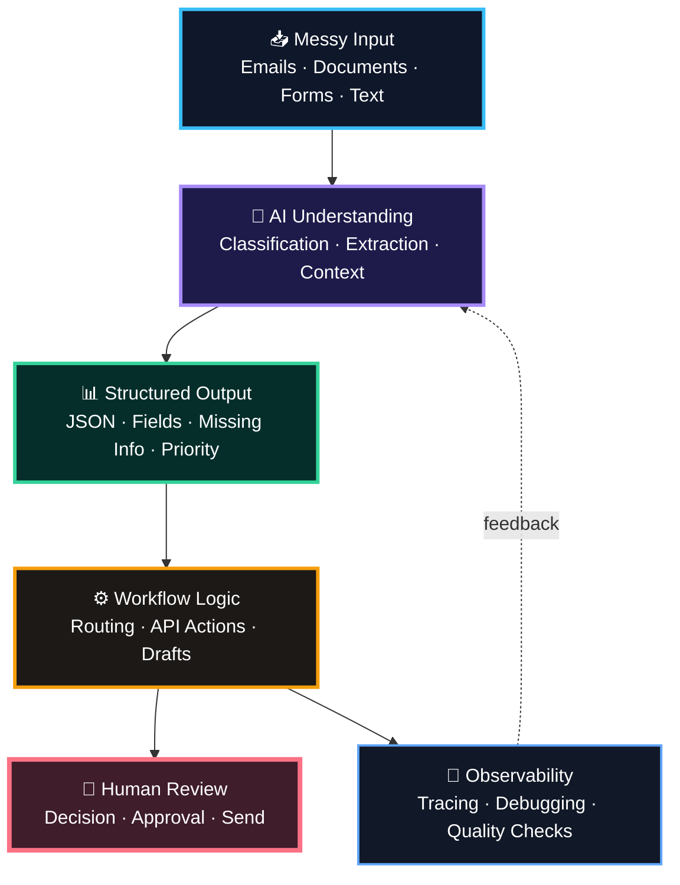
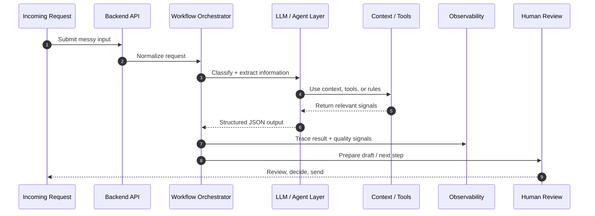

# 👨‍💻 Nico Wittemann

### AI Engineer · Multi-Agent Systems · AI Automation · Python Engineering

I build AI-supported systems that turn messy inputs into structured workflows.

  
  
  
  

---

## 🧠 What I Build

I work on **AI-supported software systems**, **multi-agent workflows**, **LLM-based automation**, and backend systems that connect AI with real business processes.

My focus is not just “chat with a model”.  
I care about systems that can:

- classify messy input
- extract relevant information
- prepare structured outputs
- connect APIs and tools
- support internal workflows
- reduce repetitive manual work
- keep humans in control where decisions matter

Before moving into software, I worked in **industrial automation** as a PLC programmer. That background still shapes how I build today: structured, process-oriented, reliable, and focused on systems that work in the real world — not just in demos.

> Most of my current AI automation and multi-agent work is part of professional or private projects and is not fully open source.  
> My public repositories show selected foundations in backend development, API design, automation logic, structured data processing, and AI integration.

---

## 🧭 AI Automation Architecture

**From unstructured input to structured workflow — with AI preparing the work and humans staying in control.**

---

## 🧩 System Capabilities

<table>
  <tr>
    <td><b>📥 Input Handling</b></td>
    <td>Email text, documents, forms, customer messages, unstructured process data</td>
  </tr>
  <tr>
    <td><b>🧠 AI Processing</b></td>
    <td>Classification, extraction, context matching, structured JSON outputs</td>
  </tr>
  <tr>
    <td><b>⚙️ Automation Logic</b></td>
    <td>Routing, draft preparation, API actions, workflow decisions, next-step suggestions</td>
  </tr>
  <tr>
    <td><b>🔐 Control & Privacy</b></td>
    <td>Human-in-the-loop design, local/cloud model tradeoffs, privacy-conscious implementation</td>
  </tr>
  <tr>
    <td><b>📡 Reliability</b></td>
    <td>Validation logic, tracing, debugging, observability, quality feedback loops</td>
  </tr>
</table>

---

## 🚀 Current Focus

<table>
  <tr>
    <td><b>🤖 Multi-Agent Systems</b></td>
    <td>Agent-based workflows, task decomposition, tool usage, structured outputs, and workflow orchestration</td>
  </tr>
  <tr>
    <td><b>⚙️ AI Automation</b></td>
    <td>Email workflows, internal process automation, classification, routing, and response preparation logic</td>
  </tr>
  <tr>
    <td><b>🧠 LLM Workflows</b></td>
    <td>Prompt structures, output validation, RAG-style context usage, and JSON-first responses</td>
  </tr>
  <tr>
    <td><b>🔌 API Integrations</b></td>
    <td>Backend services, authentication, external APIs, and workflow automation</td>
  </tr>
  <tr>
    <td><b>🔐 Privacy-Conscious AI</b></td>
    <td>Local AI models, cloud-vs-local tradeoffs, data protection aware implementation</td>
  </tr>
  <tr>
    <td><b>📊 Observability</b></td>
    <td>Tracing, debugging, monitoring, and quality checks for AI-supported workflows</td>
  </tr>
  <tr>
    <td><b>🧰 Agentic Development</b></td>
    <td>Claude Code, Codex, MCP integrations, AI-assisted engineering, and structured development workflows</td>
  </tr>
</table>

---

## 🛠️ Tech Stack

### Core Engineering

  
  
  
  
  
  
  

### AI, Agents & Automation

  
  
  
  
  
  
  
  
  

### Backend, Auth, Observability & Tools

  
  
  
  
  
  
  

---

## 🔒 Private & Professional AI Work

A large part of my current AI and automation work is not public source code.

This includes professional and private work around AI-supported systems that connect language models with real business workflows, APIs, internal tools, authentication flows, observability, and human review steps.

Current areas I work on:

- 🤖 Multi-agent systems for complex internal workflows
- ⚙️ AI-supported automation for service, operations, and customer communication
- 📩 Email-based classification, routing, and response preparation
- 🧠 LLM workflows with structured outputs, validation logic, and tool usage
- 🔌 API integrations, authentication flows, and backend automation
- 🔐 Privacy-conscious AI implementation with cloud and local model setups
- 📊 Observability and debugging for AI-supported workflows
- 🧰 Agentic development workflows using Claude Code, Codex, MCP, and custom tool patterns

The code for these systems is not public because it is connected to professional work, private business logic, product development, or internal workflows.

This profile shows the technical direction without exposing private repositories, customer data, internal company systems, or production logic.

---

## 🧪 Independent AI Automation Project

### AI Complaint Intake Copilot  
Private codebase · Demo / product prototype

I am building a private AI automation project focused on complaint intake workflows for B2B companies.

The system is designed to turn incoming complaint emails and related information into structured case outputs:

- case summary
- detected customer and product information
- missing information checklist
- prepared customer reply draft
- internal next step for the service team
- human review before any final response is sent

The goal is not to replace human decision-making.  
The goal is to reduce manual preparation work, structure messy incoming communication, and help teams respond faster with better context.

Technical direction:

- Python / FastAPI backend
- React-based demo interface
- LLM-based extraction and classification
- structured JSON outputs
- email workflow automation
- draft preparation logic
- privacy-conscious human-in-the-loop design

The repository is private because it contains product logic, implementation details, and business-specific workflow design.

---

## 🧩 Public Foundation Project

### 🖥️ Django PC Webshop Backend  
Backend API for configuring custom PCs with structured product data, authentication, order logic, payment handling, and AI-supported recommendations.

This is an older public project, but it shows several foundations that still matter in my current work: backend architecture, API design, data modeling, external integrations, payment flows, and AI integration.

**Key parts:**

- Django REST API with JWT authentication, product catalog, order management, and PostgreSQL
- GPT-4o integration for PC build suggestions based on budget and intended use
- CSV-based data import and filtering logic for structured component data
- Stripe payment flow and webhook handling
- Swagger API documentation and deployment-oriented configuration

**Tech Stack:**  
Python · Django REST Framework · PostgreSQL · JWT · Stripe · GPT-4o · Render

🔗 [GitHub Repository](https://github.com/nico-wittemann/django_pc_webshop_api)

---

<b>🧬 Technical Workflow Blueprint</b>

---

## 🧠 How I Think About AI Systems

<table>
  <tr>
    <td><b>Bad AI implementation</b></td>
    <td>Chatbot on top of a broken process</td>
  </tr>
  <tr>
    <td><b>Good AI implementation</b></td>
    <td>Structured system that understands input, prepares action, and supports human decisions</td>
  </tr>
  <tr>
    <td><b>My preferred direction</b></td>
    <td>AI as workflow infrastructure: extraction, classification, routing, drafting, validation, observability</td>
  </tr>
</table>

Useful AI is not just a chatbot.

Useful AI connects to real workflows.  
It understands messy input, extracts what matters, prepares the next step, and keeps the human in control where judgment matters.

**clear system design · practical automation · reliable implementation · real process value**

---

## 🤝 Connect

I’m interested in practical AI, automation, multi-agent systems, backend engineering, and software that creates real workflow value.

  

